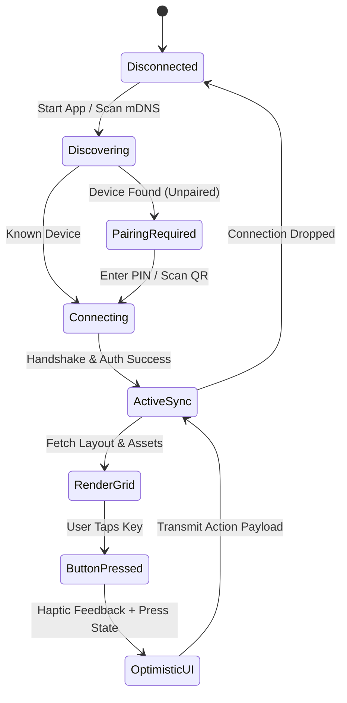
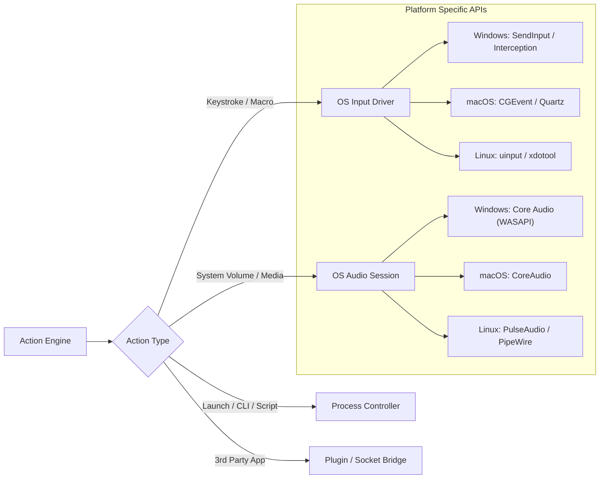
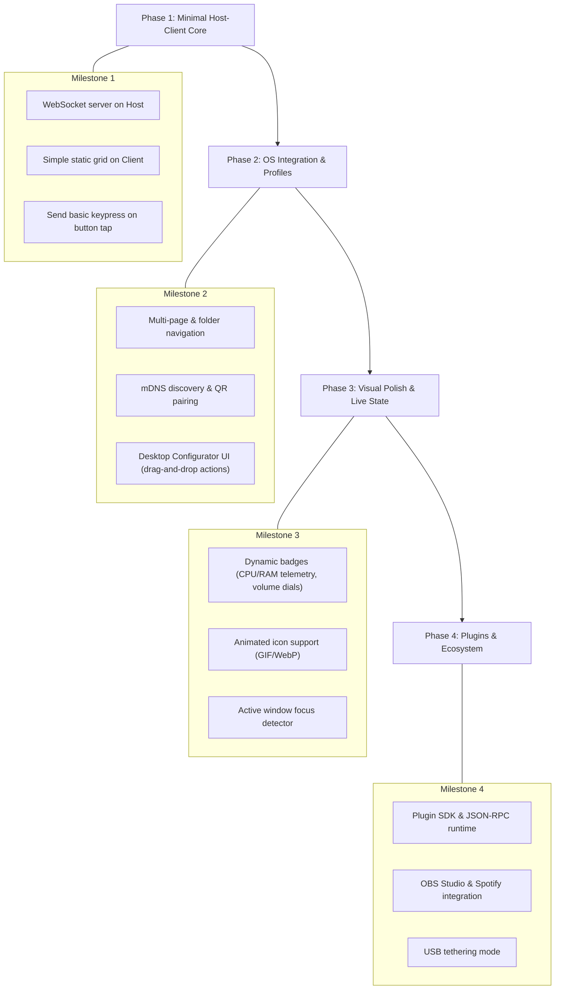

# Architecture Design: Stream Deck Clone System

This document outlines the architectural research, component breakdown, protocol design, and technology choices required to build a cross-platform Stream Deck clone (desktop automation host paired with touch-screen controller clients).

---

## 1. System Overview & Topology

A Stream Deck clone operates as a distributed client-server system across a local network or direct physical connection:

- **Host (Desktop Companion / Daemon):** The background service and configuration suite running on the target PC (Windows, macOS, or Linux). It executes keystrokes, controls audio, coordinates with 3rd-party apps (OBS, Spotify, Discord), and maintains profiles.
- **Client (Touch Controller):** The device displaying the interactive keypad (tablet, smartphone, secondary touchscreen, or browser PWA). It renders button states, labels, animated icons, and dispatches low-latency touch/press events.
- **Transport / Network Layer:** Encrypted local communication utilizing mDNS for zero-configuration discovery, paired with WebSockets or TCP for low-latency bidirectional state synchronisation.

```mermaid
flowchart TB
    subgraph Client ["Client Device (Phone / Tablet / Browser)"]
        UI["UI Layer (Grid View / Dynamic Tiles)"]
        IconCache["Icon & Asset Cache"]
        TouchHandler["Touch / Gesture Recognizer"]
        ClientNet["Client Protocol Handler (WebSocket / mDNS)"]
        UI <--> TouchHandler
        UI <--> IconCache
        TouchHandler --> ClientNet
    end

    subgraph Transport ["Local Network / USB"]
        mDNS["mDNS Discovery (Zeroconf / Bonjour)"]
        WS["Bidirectional WebSocket (MessagePack / JSON)"]
        USB["Optional USB Tether (ADB / WebUSB / Serial)"]
    end

    subgraph Host ["Desktop Host (PC / Mac / Linux)"]
        Server["Gateway & Server Engine"]
        Pairing["Pairing & Security Guard (PIN / JWT)"]
        ProfileMgr["Profile & Page Engine (Auto-Switching)"]
        ActionEngine["Action Execution Engine"]
        PluginRuntime["Plugin Host & Sandbox (RPC)"]
        OSAdapter["OS Interop (SendInput, Audio, Process)"]
        DesktopGUI["Desktop Configurator UI (Electron/Tauri/WPF)"]

        Server <--> Pairing
        Server <--> ProfileMgr
        ProfileMgr <--> ActionEngine
        ActionEngine <--> OSAdapter
        ActionEngine <--> PluginRuntime
        DesktopGUI <--> ProfileMgr
    end

    ClientNet <==> WS <==> Server
    ClientNet -.-> mDNS -.-> Server
    ClientNet <..> USB <..> Server
```

---

## 2. Core Subsystems & Components

### 2.1 Host Desktop Application

The desktop side is split into two layers: a **Background Core Daemon** and an **Admin / Layout Configurator UI**.

| Component | Responsibility | Technical Challenges / Solutions |
| :--- | :--- | :--- |
| **Discovery & Gateway** | Broadcasts service via mDNS (`_streamdeck._tcp`); manages persistent WebSocket connections. | Handling IP changes, network interfaces (Wi-Fi vs Ethernet), and firewall rules. |
| **Authentication & Pairing** | Handles initial handshake via QR code or 6-digit PIN; issues long-lived local JWTs. | Preventing unauthorized local LAN intrusions or CSRF attacks from malicious websites. |
| **Profile Engine** | Stores button layouts, multi-page hierarchies, folder navigation, and grid templates. | Low-overhead persistence (SQLite or JSON files) with rapid page flipping. |
| **Context Monitor** | Detects active foreground application window (e.g., switches to "Photoshop" profile when Photoshop is focused). | Native OS window hook polling (`GetForegroundWindow` on Windows, Accessibility APIs on macOS, `xdotool`/Wayland protocols on Linux). |
| **Action Execution Engine** | Executes triggers: single click, long press, release, dial/slider rotation, toggle states. | Concurrency handling (e.g., executing a macro sequence without blocking incoming UI frames). |
| **Native OS Interop** | Injects hotkeys, virtual keys, mouse gestures, volume control, and launches apps. | Elevated privilege requirements (handling admin/UAC barriers, platform-specific input APIs). |
| **Plugin Sandbox** | Interfaces with external APIs (OBS Studio, Spotify, Discord, Home Assistant, Twitch). | Isolating third-party plugin crashes from the core daemon using worker threads or child processes. |

---

### 2.2 Client Controller Application

The client must feel native, instantaneous, and capable of rendering 60 FPS feedback (such as animated GIF icons or live audio meters).



Key features required on the client:
1. **Dynamic Grid Layout:** Configurable matrix (e.g., 3x5, 4x8, or freeform) with automatic aspect ratio scaling.
2. **Multi-layer Key Rendering:**
   - Background: Solid color, gradient, image, or animated GIF/APNG/WebP.
   - Middle: Dynamic badge / live text (e.g., CPU temp, unread counts, audio dB meter).
   - Foreground: Title label with custom font, size, and alignment.
3. **Optimistic Touch Response:** Instant visual state change and haptic feedback on touch-down, without waiting for round-trip server confirmation.
4. **Local Asset Caching:** Caching icons and images in local IndexedDB / SQLite so page navigation is instantaneous.

---

## 3. Communication & Network Protocol Design

### 3.1 Transport Mechanisms

| Transport | Latency | Bandwidth | Setup Complexity | Best For |
| :--- | :--- | :--- | :--- | :--- |
| **WebSocket over LAN** *(Primary)* | ~2–15 ms | High | Low (zero cables) | Standard Wi-Fi operation. |
| **USB via Reverse ADB / WebUSB** | < 1 ms | Very High | Medium | Ultra-low latency, competition gaming, interference-heavy Wi-Fi. |
| **WebRTC Data Channel** | ~1–5 ms | High | High (requires ICE/STUN/Signaling) | Fallback or remote-access over internet. |

### 3.2 Protocol Payload Format

While standard JSON is easiest for development, **MessagePack** or **Protocol Buffers** is strongly recommended for production:
- Smaller wire size (~30-50% smaller than JSON).
- Native support for binary transfers (sending binary icon PNG/WebP chunks without Base64 overhead).
- Sub-millisecond serialization / deserialization overhead.

#### Example Event Payloads (JSON Representation)

**Client -> Host (Button Tap):**
```json
{
  "type": "ACTION_TRIGGER",
  "client_id": "client_tablet_01",
  "timestamp": 1727685600123,
  "payload": {
    "profile_id": "streaming_profile",
    "page_id": "main_grid",
    "key_index": 7,
    "event": "DOWN", // "DOWN", "UP", "LONG_PRESS", "DIAL_ROTATE"
    "value": null
  }
}
```

**Host -> Client (Dynamic State Update):**
```json
{
  "type": "SLOT_UPDATE",
  "timestamp": 1727685600150,
  "payload": {
    "page_id": "main_grid",
    "key_index": 7,
    "state": 1, // toggle state
    "badge": "REC",
    "badge_color": "#FF0000",
    "icon_hash": "a1b2c3d4e5", // If client doesn't have it, request via asset endpoint
    "title": "OBS Stream"
  }
}
```

### 3.3 Zero-Configuration Discovery & Security Model

1. **Discovery (mDNS):**
   - Host announces: `_streamdeck-clone._tcp.local` on port `4455` with TXT records (host name, version, pairing status).
   - Client searches for the service using native mDNS (Bonjour / Avahi).
2. **Secure Pairing Handshake:**
   - On first connection, Host displays a 6-digit numeric code or dynamic QR Code containing `(ip, port, challenge_token)`.
   - Client signs the challenge with the entered code and sends it back.
   - Host generates a persistent device UUID and signs an asymmetric JWT token stored securely on the client.
3. **Reconnection:** Client directly connects using the stored JWT token, bypassing the pairing screen.

---

## 4. Native OS Integration & Macro Engine

Executing hardware inputs requires low-level OS APIs:



### Critical OS Considerations:
- **Windows:** Standard `SendInput` won't work in DirectX fullscreen games or apps running as Administrator (UAC). The desktop daemon needs optional installation as a Windows Service or elevated process with UI Access flag (`uiAccess=true`).
- **macOS:** Requires user accessibility permissions (`Accessibility` and `Input Monitoring`) under Privacy & Security in System Settings.
- **Window Monitoring:** To switch profiles automatically, run an event hook or low-frequency poll (e.g., 200ms) for the foreground window process name.

---

## 5. Plugin Architecture

To allow community extensions (OBS, Spotify, Twitch, Discord, Philips Hue, Home Assistant), the app should implement an extensible plugin model.

### 5.1 Plugin Package Structure
```
my-plugin/
├── manifest.json      # Metadata, action definitions, configurable fields, icon
├── index.js           # Plugin backend logic
├── assets/            # Static icons, SVGs
└── property_inspector/ # HTML/JS for custom settings in desktop config UI
```

### 5.2 Communication Model
- **Process Isolation:** Each plugin runs in an isolated Node.js child process, Deno sandbox, or WebAssembly runtime.
- **IPC Protocol:** Standard JSON-RPC 2.0 over standard I/O (`stdin`/`stdout`) or local WebSocket.
- If a plugin crashes, only its tiles go into an error state without crashing the main desktop server.

---

## 6. Recommended Technology Stacks

Depending on performance goals and developer velocity, here are the three optimal stack architectures:

### Option A: Tauri (Rust Core) + Web/Flutter Client *(Recommended for performance & memory)*
- **Host Backend:** **Rust** (Tauri). Ultra-fast, minimal memory footprint (~25–40MB RAM), native input handling via `enigo` or native Win32/X11 bindings, built-in Tokio async WebSocket server.
- **Host Config UI:** **React / Svelte / Vue** running inside the Tauri webview.
- **Client (Mobile / Tablet):** **Flutter** or **React Native**. Compiles directly to native 60–120 FPS views with hardware-accelerated canvas for animated keys.

### Option B: Node.js / Electron + PWA Client *(Recommended for rapid development & plugins)*
- **Host:** **Electron** (Node.js + Chromium). Easy access to the vast npm ecosystem (OBS-WebSocket, Spotify APIs, RobotJS).
- **Client:** **Progressive Web App (PWA)**. Any device on the LAN can open `http://desktop-ip:port` in Chrome/Safari, add to home screen, and operate without App Store installation hurdles.

### Option C: .NET 8 / C# (Windows Native) + MAUI Client *(Best for Windows-centric power users)*
- **Host:** **C# .NET 8 (WPF / WinUI 3)**. Direct P/Invoke access to Win32, WASAPI, DirectX hooks, and low memory usage.
- **Client:** **.NET MAUI** or Native Android/iOS.

---

## 7. Implementation Roadmap


